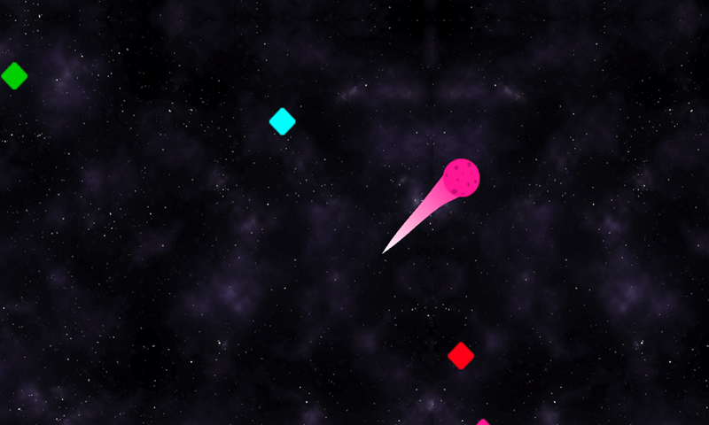
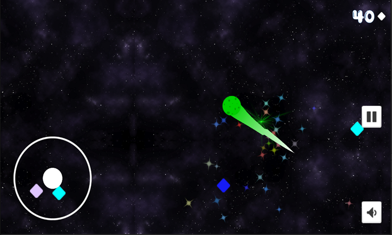
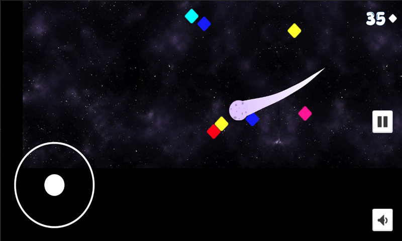

# color-sphere

ColorSphere is a visually stunning 2D adventure where players control a color-shifting orb through a cosmic landscape. Collect orbs matching your current color while avoiding others to score points. With a dark celestial backdrop, each successful collection increases the challenge, introducing more orbs to navigate. 

## Play Game
- <a href="https://carltonmpofu.itch.io/color-sphere" title="play game">Play Game (itch.io)</a> 

## Screenshots
| Images | Images |
| --- | --- |
|  |  |

